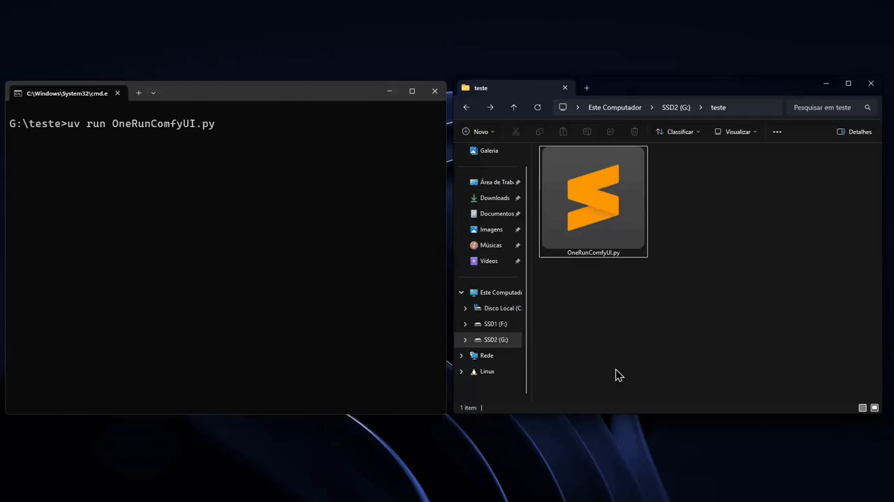

# OneRunComfyUI

Automated and customizable script for installing and configuring ComfyUI on Windows with custom nodes and models.



## 📋 Requirements

- Windows 10/11
- Internet connection

## 🚀 Installation and Usage

### 1. Install uv

Download and install **uv** (ultra-fast Python package manager):

1. Open PowerShell as administrator
2. Run the command:
```powershell
powershell -c "irm https://astral.sh/uv/install.ps1 | iex"
```

Or download directly from the official website: [https://docs.astral.sh/uv/getting-started/installation/](https://docs.astral.sh/uv/getting-started/installation/)

Why uv? Because it's good; Future updates will need it too.

### 2. Run the Script

1. Download the `OneRunComfyUI.py` file
2. Open terminal/PowerShell in the folder where you saved the file
3. Execute:
```bash
uv run OneRunComfyUI.py
```
or
```bash
python OneRunComfyUI.py
```

The script will automatically:
- ✅ Download and install ComfyUI
- ✅ Set up necessary tools (7zip, curl, git)
- ✅ Download configured custom nodes
- ✅ Download configured models
- ✅ Clean up temporary files

## 🔧 Customization

### Add Custom Nodes

Edit the `custom_nodes_git_urls` in the main function of the `OneRunComfyUI.py` file:

```python
custom_nodes_git_urls = [
    "https://github.com/rgthree/rgthree-comfy.git",
    "https://github.com/ltdrdata/ComfyUI-Manager",
    "https://github.com/your-custom-node-here.git",  # Add more here
]
```

### Add Models

Edit the `models` in the main function of the `OneRunComfyUI.py` file:

```python
models = [
    {
        "url": "https://huggingface.co/model/resolve/main/file.safetensors",
        "filename": "filename.safetensors",
        "directory": checkpoints_dir  # or upscale_dir
    },
    # Add more models here
]
```

**Available directory types:**
- `checkpoints_dir` - For main models
- `upscale_dir` - For upscale models

## 📝 Notes

- The script checks if files already exist before downloading
- Works offline after first installation (except for new content downloads)
- Automatically removes temporary files after installation

## 🎯 After Installation

ComfyUI will be available at:
```
ComfyUI_windows_portable/
```

To start ComfyUI, run the corresponding `.bat` file in the installed folder.
